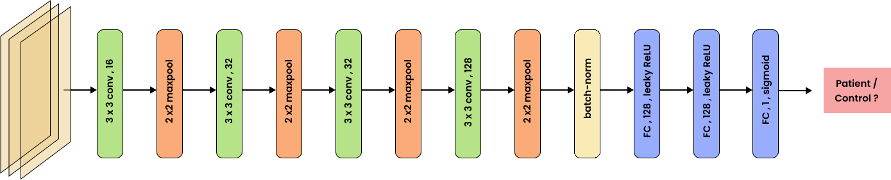

# 🧠 Parkinson's Disease Detection from Hand-Drawn Patterns

This project implements a shallow Convolutional Neural Network (CNN) to classify hand-drawn spirals, circles, and meanders from individuals with Parkinson’s Disease (PD) and healthy controls. To address the limited dataset size, geometric and photometric data augmentations—such as rotation, scaling, and brightness adjustments—were applied. These enhancements helped the CNN effectively identify motor control impairments linked to PD, achieving promising classification results.

---

## 📁 Dataset

- The augmented dataset used here, is available on **Kaggle**:  
  🔗 [[Link to Kaggle Dataset](https://www.kaggle.com/datasets/sagnikkayalcse52/handpd-augmented-data)](#) 

It contains:
- Original drawings (spirals, circles, meanders)
- Augmented images using geometric and photometric techniques

---

## 🧐 Model Architecture

- A **shallow CNN** architecture with fewer layers to reduce overfitting on small data
- SVG and PNG images of the architecture are included in the repo:
  - `PD_net.svg`



---

## 🧪 Pretrained Models

Ready-to-use PyTorch `.pth` files are available in the `PD_torch_logs/` directory:
- `best_model0.9677.pth` (high validation accuracy)
- Can be loaded and used for inference via the `prediction.py` script

---

## 📦 Installation

```bash
pip install -r requirements.txt
